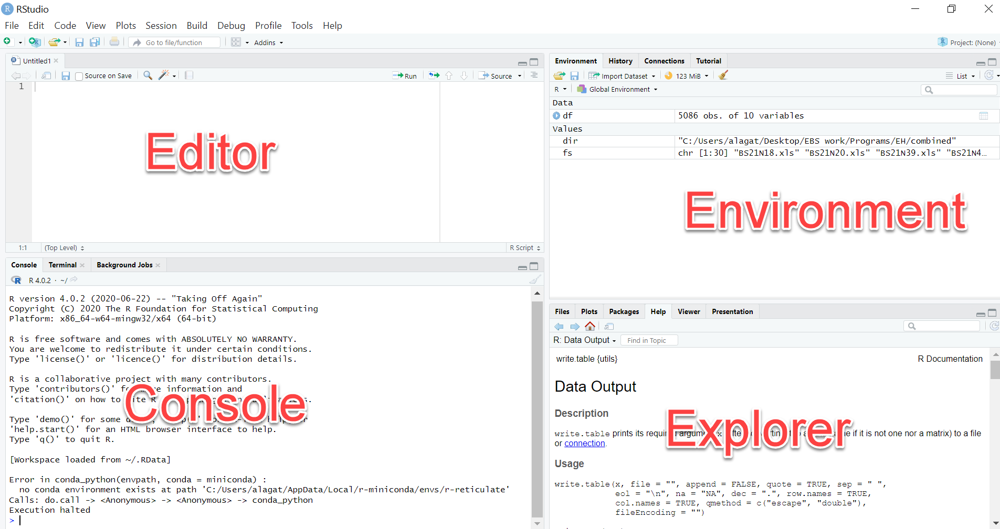

## Install Java
- Check if java is already installed in your computer. Launch the terminal and issue the command `java --version`
- If not download [Java](https://www.oracle.com/ke/java/technologies/downloads/#jdk20-windows)
- After downloading, right click and select run as administrator
- Follow the prompts to install it in your application
- After installation, open windows terminal and issue the command `java --version` to checj 

## Install R and RStudio

### R Software
1. Visit [Cran-Project website](https://cran.r-project.org/bin/windows/base/)
2. Click `Download R-x.y.z for Windows` and wait for it to complete downloading
3. Locate the downloaded software in your machine, right-click and install it on your machine (preferably as Administrator). 
4. Follow the prompts to complete the installation

In case you are not using windows to help you install

### RStudio (Posit) Software
1. Visit the [posit website](https://posit.co/download/rstudio-desktop/) download page and click `DOWNLOAD RSTUDIO DESKTOP FOR WINDOWS` and wait for the download to complete
2. Locate the downloaded software in in your machine, right-click and install it on your machine (preferably as Administrator). 
4. Follow the prompts to complete the installation

---